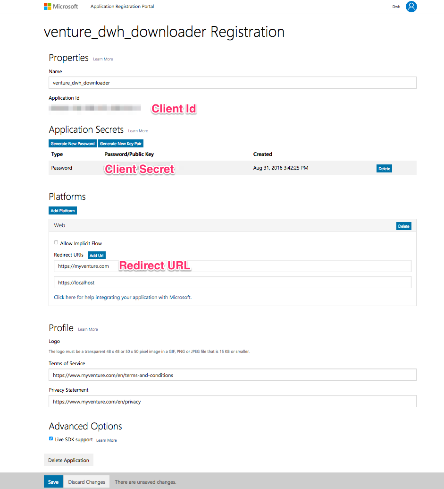
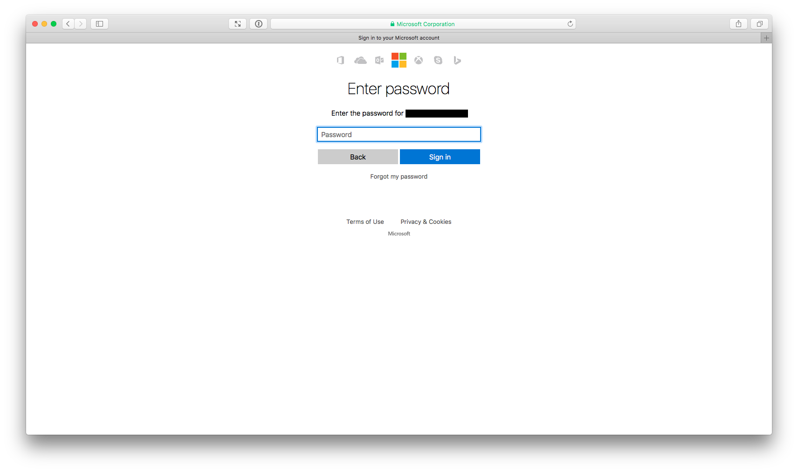
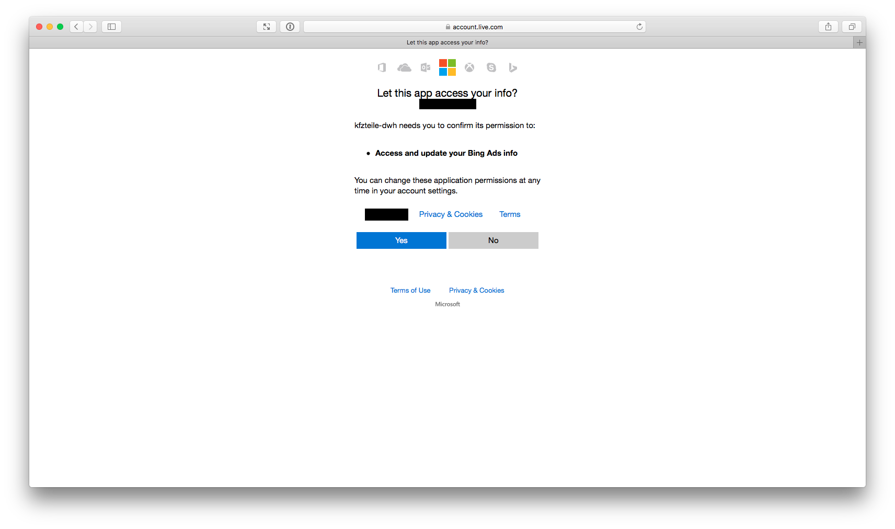

# BingAds Performance Downloader

A Python script for downloading performance data from the [BingAds API version 9](https://msdn.microsoft.com/en-us/library/bing-ads-overview(v=msads.100).aspx) to local files. The code is largely based on [Bing Ads Python SDK](https://github.com/BingAds/BingAds-Python-SDK).
 

## Resulting data
**BingAds Performance Downloader** gives measures such as impressions, clicks and cost. The script creates one csv file per day in a specified time range:

    /tmp/bingads/2016/05/02/bing/ad_performance.csv.gz
    /tmp/bingads/2016/05/03/bing/ad_performance.csv.gz
    
    
 Each line contains one ad for one day:
 
    GregorianDate        | 2/12/2016
    AccountId            | 17837800573
    AccountName          | Online Veiling Gent
    CampaignId           | 254776453
    CampaignName         | Veiling Gent
    AdGroupId            | 3508678047
    AdGroupName          | BE_NL_GEN_Auction_City_{e}
    AdId                 | 9011292478
    Keyword              | Veiling
    KeywordId            | 2271053633
    Device type          | Tablet
    BiddedMatchType      | Phrase
    Clicks               | 0
    Impressions          | 5
    Ctr                  | 0.00
    AverageCpc           | 0.00
    Spend                | 0.00
    QualityScore         | 8
    Conversions          | 0
    Revenue              | 0
    Network              | Bing and Yahoo! search
    

## Getting Started

  
### Installation

 The Google AdWords Performance Downloader requires:

    Python (>= 3.5)
    bingads (>=10.4.11)
    click (>=6.0)

The easiest way to install google-adwords-downloader is using pip

    pip install git+https://github.com/mara/bingads-performance-downloader.git

If you want to install it in a virtual environment:

    $ git clone git@github.com:mara/bingads-performance-downloader.git bingads_downloader
    $ cd bingads_downloader
    $ python3 -m venv venv
    $ venv/bin/pip install .

### Set up your OAuth2 credentials

Getting access to the Bing Ads Account:

Ask your SEM manager to invite you to the Bing Ads Account of the company. The role should be Super Admin. Once you receive the confirmation e-mail 
(may take up to 2 hours), you should click on the link and create a Microsoft account. 

Getting **developer token**:
Go to this page https://developers.bingads.microsoft.com/Account, you will find your developer-token. You have to be logged in with your Microsoft account.

Getting **oauth client id** and **oauth client secret** :
Go to this page https://apps.dev.microsoft.com/. You have to be logged in with your Microsoft account.

Follow these steps:

    Copy the Application Id, it will be the 'oauth-client-id' ()
    Copy now the field 'Password/Public key' as 'oauth-client-secret' ()
    Copy now the redirect URI as 'oauth-client-redirect-uri' ()

In order to access the BingAds API you have to obtain the OAuth2 credentials from BingAds.

    $ refresh-bingsads-api-oauth2-token \
    --developer_token ABCDEFEGHIJKL \
    --oauth2_client_id 123456789 \
    --oauth2_client_secret aBcDeFg 

This will open a webbrowser to allow the OAuth2 credentials to access the API on your behalf.  

**Copy the url from the browser** as instructed in the commandline. Paste it into the command line where you are running 
`refresh-bingsads-api-oauth2-token` and press enter. 

The script should complete and display an offline **refresh token** on the command line. Keep this refresh token for the download step.

## Usage

To run the BingAds Performance Downloader call `download-bingsads-performance-data` with its config:  

    $ download-bingsads-performance-data \
    --developer_token ABCDEFEGHIJKL \
    --oauth2_client_id 123456789 \
    --oauth2_client_secret aBcDeFg \
    --oauth2_refresh_token MCQL58pByMOdq*sU7 \
    --data_dir /tmp/bingads

